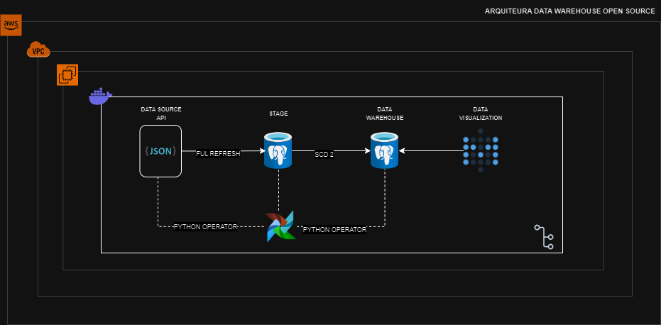
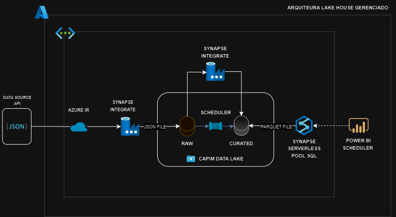
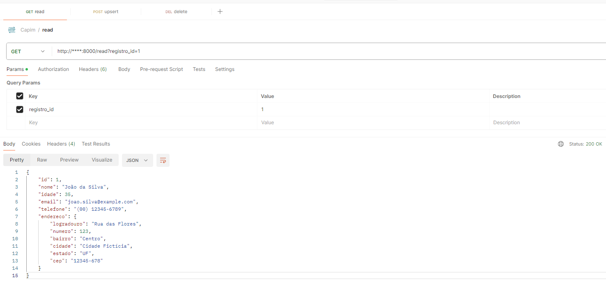
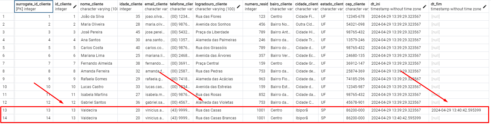
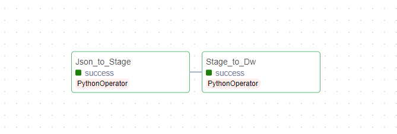
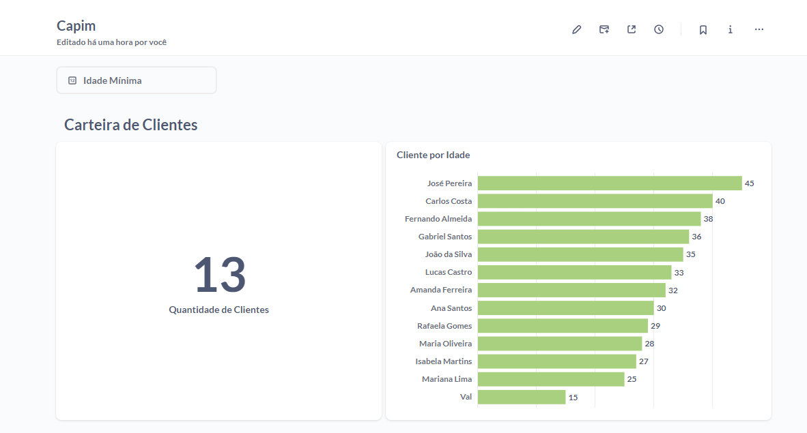
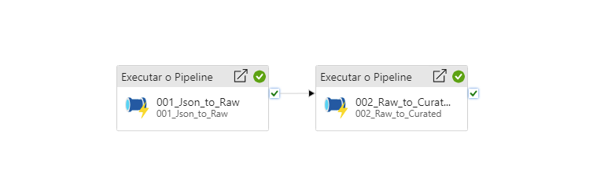
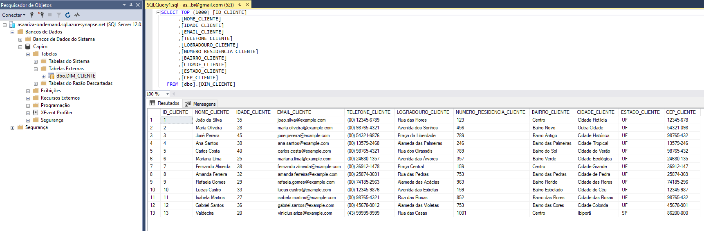
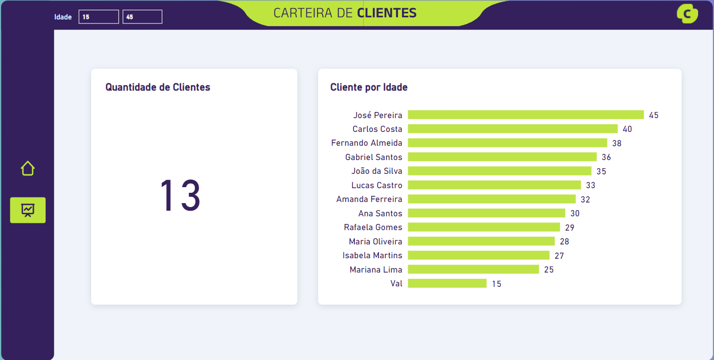

# Projeto 1 - Engenharia de Dados

### Arquitetura 

Foram desenvolvidas duas arquiteturas para a solução:

#### Arquitetura Open Source

Na primeira arquitetura, foi implementada uma stack open source, utilizando os recursos:

- **EC2**: Foi implantada uma instância EC2 para hospedar a aplicação.
- **Docker e Containers**: Utilizou-se o Docker para criar containers isolados para cada componente da solução:
  - Container para <a href="api">API</a>: Leitura e manipulação do arquivo de origem.
  - Container para o <a href="postgres">PostgreSQL</a>: Armazenar os dados do banco de dados.
  - Container para o <a href="airflow">Airflow</a>: Orquestrar o fluxo de dados da pipeline.
  - Container para o <a href="metabase">Metabase</a>: Fornecer uma interface de visualização e análise aos dados armazenados no PostgreSQL.

  

#### Arquitetura Gerenciada

A segunda abordagem adotada foi uma arquitetura gerenciada, utilizando os serviços de nuvem da Microsoft Azure:

- **Azure Data Lake Storage (ADLS)**: Armazenar os dados no repositório de objetos.
- **Data Factory**: Criar o pipeline e orquestrar o fluxo de dados.
- **Azure Serverless SQL Pool**: Camada de abstração. Executar consultas sob demanda sem a necessidade de provisionar ou gerenciar infraestrutura de banco de dados.
- **Power BI**: Visualizar dos dados consultados por meio do Azure Serverless SQL Pool.

  

### Implementação do Pipeline de Dados Open Source

Para implementar o pipeline de dados, foram realizadas as seguintes etapas:

#### Fonte de Dados:

A fonte de dados será uma API construída em Python, encapsulada em um contêiner Docker, que acessa informações de "clientes" (convensão para solução do desafio) armazenadas em um arquivo JSON. Os endpoints disponíveis na API incluem: read (para recuperar todos os dados do arquivo ou de um ID específico), upsert (para inserir ou atualizar registros) e delete (para remover um registro com base no ID).

  

#### Extração dos Dados

**Json to Stage**: Um <a href="airflow/dags/scripts/Json_to_Stage.py">script em Python</a> foi desenvolvido para consultar a API e recuperar os dados do JSON. Os dados foram armazenados na tabela "Stage" do banco de dados PostgreSQL.

**Stage to DataWarehouse (SCD Tipo 2)**: Foi desenvolvida a <a href="airflow/dags/scripts/Stage_to_Dw.py">lógica para aplicar o método SCD tipo 2</a> aos dados obtidos na etapa anterior. Os dados resultantes foram gravados na tabela de dimensão do banco de dados "DataWarehouse".
Esta lógica verifica se já existe um registro na tabela de dimensão com o mesmo ID_CLIENTE. Se existir, ela verifica se algum campo foi alterado. Se algum campo foi alterado, atualiza a data de término do registro existente e insere o novo registro com a data de início como a data atual. Se o registro não existir, é inserido um novo registro com a data de início como a data atual. Além disso, os registros na tabela de dimensão que não estão mais presentes são marcados como terminados.

  

A utilização do método SCD tipo 2 foi motivada pela natureza dos dados, que foram considerados como "dados de clientes" para a solução do desafio. O método SCD tipo 2 permite rastrear as mudanças nos atributos dos clientes ao longo do tempo, mantendo um registro histórico completo das alterações realizadas.

#### Orquestração

3. **Orquestração do Processo**: O Apache Airflow foi utilizado para definir e executar o pipeline de extração e carga de dados. A <a href="airflow/dags/Pipeline_Json_to_Dw.py">DAG </a> foi configurada para executar as etapas de forma ordenada e com dependências entre elas.

  

#### Visualização

Para visualizar e explorar os dados armazenados no PostgreSQL, utilizou-se o Metabase.
Uma conexão ao banco de dados PostgreSQL foi configurada para a geração de indicadores relacionados aos clientes.

  

### Implementação da Arquitetura Gerenciada

Para implementar a arquitetura gerenciada, foram realizadas as seguintes etapas:

#### Extração dos dados

Uma atividade na Azure Data Factory foi configurada para recuperar os dados da API. Os dados brutos foram armazenados na camada "raw" do Azure Data Lake Storage (ADLS).
Uma segunda atividade na Azure Data Factory foi configurada para processar os dados brutos armazenados na camada "raw". Os dados processados foram gravados na camada "curated" do ADLS, no formato Parquet.

#### Orquestração

 O Azure Data Factory foi utilizado como serviço de orquestração de dados na nuvem da Microsoft Azure. Ele foi configurado para criar e gerenciar pipelines de dados, garantindo a execução ordenada das atividades de extração e processamento dos dados.

  

**Consulta aos dados**: 

Configurou-se o Synapse Serverless para acessar os dados armazenados na camada "curated" do Azure Data Lake Storage (ADLS).

  

#### Visualização

Utilizou-se o Power BI, para criar dashboards e visualizações dos dados consultados por meio do Synapse Serverless, completando a arquitetura de Lake House. 

  

### Considerações Finais

Além das etapas mencionadas, outras atividades foram essenciais para o desenvolvimento completo do desafio. Isso incluiu a configuração do servidor de aplicação, a definição de usuários e permissões, versionamento de código, a configuração da rede para garantir a conectividade adequada entre os componentes, e a implementação de medidas de segurança.